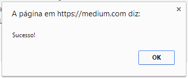

Como qualquer chamada Ajax o método **Ajax BeginForm** tem os retornos padrões de uma chamada Ajax, que são declaradas no **AjaxOptions**, mas o que muitos não sabem é possível passar funções personalizadas para o retorno desses eventos, nesse exemplo irei mostrar num alert o resultado de uma requisição Ajax, usando o evento **OnSuccess**.

View:

Função que trata o retorno do evento **OnSuccess:**

Controller:

Resultado:

Isso deve funcionar para todos os eventos, diferentes nomes de argumentos estão disponíveis para os diferentes eventos:

-   OnBegin – xhr
-   OnComplete – xhr, status
-   OnSuccess – data, status, xhr
-   OnFailure – xhr, status, error

Para funcionar corretamente é preciso adicionar a referência do js: **jquery.unobtrusive-ajax.js** na **View**.
