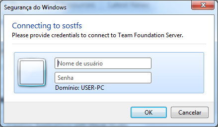
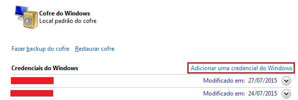
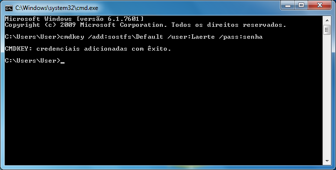

Estou utilizando TFS para versionar o projeto que estou trabalhando atualmente, mas algo sempre me incomodava:



Não há uma opção de lembrar a senha! Pra resolver isso, temos que criar uma credencial do Windows pro TFS. Você pode adicionar uma credencial pelo **Gerenciador de Credenciais** do Windows que fica localizado no Painel de Controle ou usar esse atalho:

```
control.exe /name Microsoft.CredentialManager
```

Com o Gerenciador de Credenciais aberto, clique em **Adicionar uma credencial do Windows**. Preencha com os dados como mostrado abaixo. Endereço não é o IP do servidor e sim o nome do servidor que você pretende se conectar, pronto! Volte pro VS e e conecte no TFS novamente não irá mais aparecer aquela janela de autentificação.

Você pode fazer o mesmo processo com apenas 1 linha utilizando o comando **cmdkey**:

```
cmdkey /add:servidor /user:usuario /pass:senha
```

**Referências:  
**[HOW TO “REMEMBER MY PASSWORD” WITH TFS 2010](http://www.richard-banks.org/2010/07/how-to-remember-my-password-with-tfs.html)  
[Cmdkey — TechNet](https://technet.microsoft.com/en-us/library/cc754243.aspx)
