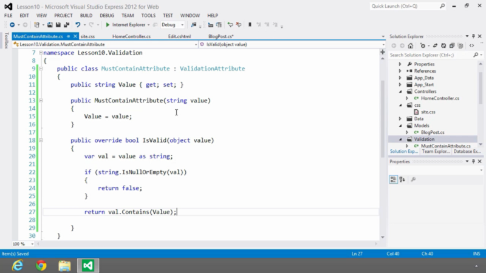

1.  Crie uma classe que herde da classe **ValidationAttribute:**

```
public class Teste : ValidationAttribute
{
 public string Valor { get; set; }
 public Teste(string valor)
 {
 this.Valor = valor;
 }
}
```

3\. Sobrescreva o método **IsValid()**;

```
public override bool IsValid(object value)
{
 // Validação
}
```

Depois é só usar na Model:

```
[Teste(“Parametro”), ErrorMessage = “{0} não é válido.”]
public string Campo { get; set; }
```
