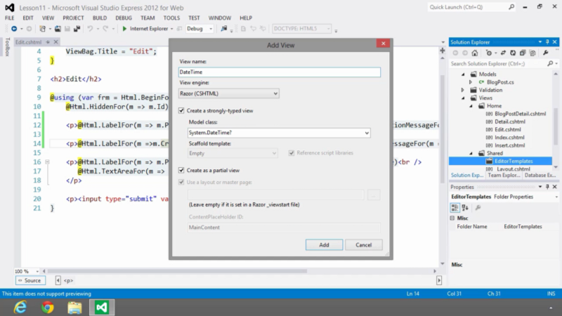
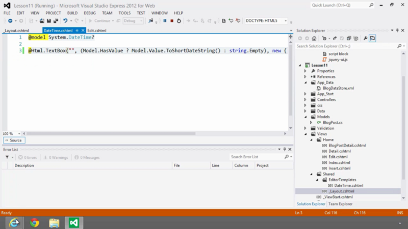

Editor Template pode ser entendido como uma View personalizada para um tipo especifico de dado.

Para usar esse recurso é preciso criar uma pasta com o nome “**EditorTemplates**”. Você pode criar essa pasta dentro da View específica como “Home” (Nesse caso o Editor Template só será visto pelas Views que estiverem dentro dessa pasta), ou você pode criar na pasta **Shared** assim todas as views vão enxergar seu template.

Feito isso, você deve criar uma **PartialView tipada** com o nome do classe do tipo ou model, exemplo: **System.DateTime?**



A convenção de nome é usar o mesmo nome do tipo de dado.

PartialView você codifica como o conteúdo vai ser visto, nesse caso quando a programador usar um EditorFor num campo DateTime vai ter um TextBox com um Date Picker.



Caso você não for usar esse template em todo o projeto para esse tipo de dado você deve por outro nome, como “DataPersonalizada”, se esse for o caso você de por essa **Data Annotation,** na propriedade do Model:

```csharp
[UIHint(“DataPersonalizada”)]
```

Você também pode criar um Editor Template personalizado pra Model inteira, na View a forma de chamar é:

```csharp
@EditorFor(m => m)
```
