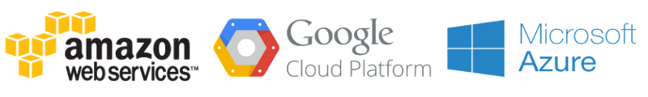

As maiores plataformas de cloud como Amazon Web Services (AWS), Azure e Google Cloud Platform(GCP) oferecem uma camada gratuita onde é possível utilizar os recursos computacionais dessa plataformas para projetos pequenos ou também para fins de aprendizado.

### Nível gratuito do Google Cloud Platform

[**Camada gratuita do GCP — Avaliações gratuitas estendidas e produtos sempre gratuitos | Google Cloud**  
_A camada gratuita do GCP expande nosso programa gratuito de duas maneiras: crédito de $ 300 em uma Teste grátis por 12…_cloud.google.com](https://cloud.google.com/free/?hl=pt-br "https://cloud.google.com/free/?hl=pt-br")

O nível gratuito do Google Cloud Platform, tem duas opções: uma avaliação gratuita por 12 meses com crédito de US$ 300 e o Sempre gratuito. A avaliação por 12 meses permite o uso de qualquer produto do GCP. Com o Sempre gratuito, você avalia os produtos participantes gratuitamente até os limites de uso. Esses limites não expiram, o que facilita o teste e o desenvolvimento com esses produtos.

### Nível gratuito da AWS

[**Nível gratuito da AWS**  
_O AWS Marketplace oferece produtos de software gratuitos e pagos que operam no nível gratuito da AWS. Se você se…_aws.amazon.com](https://aws.amazon.com/pt/free/ "https://aws.amazon.com/pt/free/")

O nível gratuito da AWS permite obter gratuitamente experiência prática com a plataforma, os produtos e os serviços da AWS. Alguns dos recursos que você tem no nível gratuito da AWS:

-   Amazon EC2–750 horas por mês
-   Amazon RDS — 750 horas por mês de uso do banco de dados db.t2.micro (mecanismos de banco de dados aplicáveis)
-   Amazon S3–5 GB de armazenamento padrão
-   AWS Lambda — 1 milhão solicitações gratuitas por mês

E também possui os serviços sempre serão gratuitos: [https://aws.amazon.com/pt/free/#legal](https://aws.amazon.com/pt/free/#legal)

### Microsoft Azure

[https://azure.microsoft.com/pt-br/free/](https://azure.microsoft.com/pt-br/free/)

É gratuito para começar e você ainda recebe um crédito de R$670 para gastar nos primeiros 30 dias. Você não será cobrado, mesmo se começar a usar os serviços, até que você opte por atualizar. Por até 12 meses após a atualização, determinadas quantidades de produtos populares são gratuitas. Depois de 12 meses, você será cobrado por estes serviços pela taxa de pagamento conforme o uso.

Alguns dos recursos que você tem acesso no Azure tem acesso no nível gratuito do Azure:

-   VMB1S — 750 Horas (Máquinas virtuais LInux e Windows)
-   Banco de dados SQL — 250 GB

O azure também possui serviços que sempre serão gratuitos. É possível conferir quais são no link acima na página da plataforma.

### Cloudflare

[https://www.cloudflare.com/br/plans/#moredetail](https://www.cloudflare.com/br/plans/#moredetail)

Cloudflare apesar de não ser uma plataforma de cloud resolvi adicionar também nesse artigo pois possui um nível gratuito interessante que pode ser utilizados em pequenos sites ou blogs que oferece:

-   Proteção DDoS limitada
-   Certificado SSL compartilhado
-   Modo “Estou sob ataque” (I’m Under Attack™)

Espero que esse artigo ajude quem está iniciando ou quem já possui experiência na área possa utilizar esse serviços para aprender um pouco mais sobre essa plataformas e serviços, se você conhece mais algum serviço semelhante e gratuito comente que eu adiciono nessa lista posteriormente. :)
