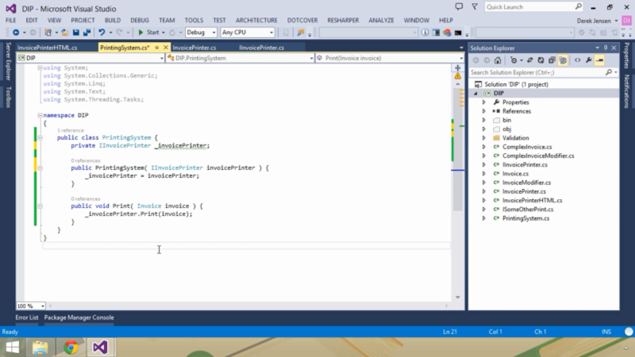

Nesse post irei sintetizar o que eu aprendi assistindo o curso: “[**SOLID Design Patterns in C#**](http://code.tutsplus.com/courses/solid-design-patterns-in-c)” da **Tuts+.**

**SOLID** — (_Single responsibility, Open-closed, Liskov substitution, Interface segregation and Dependency inversion_).

**S \[Single responsibility\]**— “Cada objeto deve fazer apenas o que é de sua responsabilidade”

**Exemplo:** Um objeto do tipo “Conta” pode possuir métodos de cálculos, mas não um método para imprimir a “Conta” pois não é responsabilidade da “Conta” saber como imprimir.

**O \[Open-closed\]** — “O Objeto deve ser aberto para extensões e fechado para modificações”

**Exemplo:** Isso que dizer que você só deve escrever um método uma vez e não modifica-lo mais, por exemplo um método de validação. Você pode criar uma classe “ValidacaoProduto” que tem uma propriedade que é um Lista do tipo “Validacao” uma classe abstrata que contém um método abstrato booleano chamado “Validar”. Na classe “ValidacaoProduto” existe um método “Validar” também, esse percorre a Lista de “Validacao” e verifica se nenhum dos retornos dos métodos “Validar” é falso, sendo assim passando na validação! Assim sempre que vou adicionar uma nova validação eu só passo o meu objeto que herda da classe “Validacao” onde contém minha validação personalizada.

**L \[Liskov substitution\] **— “Se o objeto “X” é subtipo de “Y”, então os objetos do tipo “Y” podem ser substituídos pelo objeto do tipo “X” sem que seja necessário alterar o código”

**Exemplo:** Uma classe que realize cálculo usando o objeto “Y”, deve retorna dados consistes quando passado um objeto do tipo “X”.

**I \[Interface segregation\]** — “Nenhum objeto deve ser forçado a implementar alguma característica ou interface que ele não precise.”

**Exemplo:** Uma classe pode herdar de um interface, mas deve implementar todos os métodos, caso algum deles não seja usado é melhor criar outra interface especifica.

**D** \[**Dependency inversion**\] — “Um objeto de deve depender da Interface e não da sua implementação”

**Exemplo:** A classe “**PrintingSystem**” funciona para qualquer objeto que herde a interface “**IInvoicePrinter**”.

